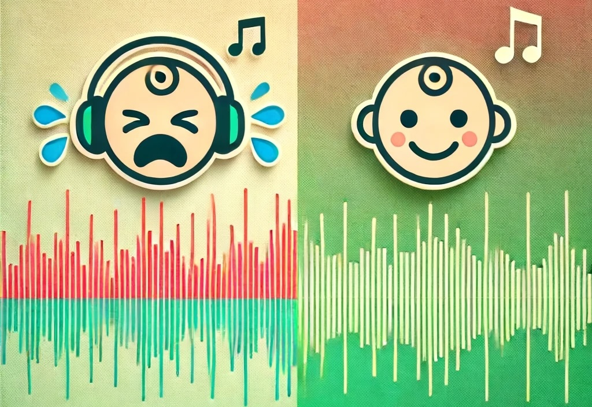

# 🍼 Infant Crying Detection Algorithm


This project presents an advanced **Infant Crying Detection Algorithm** using PyTorch, a shift from the original TensorFlow implementation. It is specifically tailored for training and testing with the Northwestern LENA dataset, which is instrumental in studying audio patterns of infant cries, but can be used with any other wav dataset. Crying detection algorithms are particularly useful in psychology research because crying is one of the primary methods through which infants express their feelings and emotions. The frequency and pattern of crying events can also be indicative of certain clinical symptoms, such as colic, or can be used to assess the overall well-being and developmental progress of infants.


## 🧑‍🔬 Contributors
- Kyunghun Lee (National Institutes of Health)
- Lauren Henry (National Institutes of Health)
- Laurie Wakschlag (Northwestern University)
- Elizabeth Norton (Northwestern University)
- Francisco Pereira (National Institutes of Health)
- Melissa Brotman (National Institutes of Health)

## 📄 Citation Information
If you use this code for academic research, please include the following citation:

K. Lee, L. Henry, M. Brotman, F. Pereira, “Infant Crying Detection Algorithm,” GitHub repository, National Institute of Mental Health, June 14, 2024. [Online]. Available: https://github.com/EDB-Accelerator/Infant-Crying-Detection. [Accessed: Day-Month-Year].

## 🌱 Background
The development of this code is inspired and based on prior work accessible at [AgnesMayYao/Infant-Crying-Detection](https://github.com/AgnesMayYao/Infant-Crying-Detection), which provides a foundational framework for our enhancements using PyTorch.


## 🔧 Requirements
To run this project, you will need PyTorch along with several other libraries focused on audio processing and analysis. A comprehensive list of required Python packages can be found in `requirements.txt`.

Please ensure that all dependencies are installed to guarantee the functionality of the detection algorithm.

   ```bash
   pip install -r requirements.txt
```

## 🗂️ Sample Data
Sample dataset included with specifications:
- **Input data format**: WAV file
- **Channel**: Mono
- **Sample Rate**: 16kHz
- **Bits per sample**: 16

For additional similar datasets, consider accessing the HomeBank deBarbaro dataset provided by the University of Texas at Austin: [Here](https://homebank.talkbank.org/access/Password/deBarbaroCry.html).

## 📈 Output
- `1`: Crying detected
- `0`: Non-crying (i.e., no crying detected)

## 🛠️ Source Code
Detailed explanations of source code files can be found below:
- `src/preprocessing.py`: Prepares audio data by applying filters and creating spectrograms for analysis. This script loads an audio file and applies a high-pass filter to emphasize frequencies typical of infant cries, then constructs a mel spectrogram to visualize frequency distribution over time. The spectrogram undergoes noise reduction, and its power values are summed and smoothed to facilitate clear threshold-based event detection. The processed data is then further analyzed to consolidate close crying events and eliminate brief, isolated sounds, ensuring only significant crying periods are detected. This structured approach enables the effective isolation and characterization of infant crying sounds within a given audio sample, aiming to offer a reliable tool for studies or applications that require accurate crying detection.
- `src/train_alex.py`: Manages the training of a customized (adapted) AlexNet-like model using PyTorch for binary classification tasks. Initially, the script processes audio data into mel spectrograms and preprocesses these by segmenting and labeling according to designated annotations. It employs noise reduction, time masking, and segmentation strategies to prepare data suitable for training the neural network. The core of the program defines a deep learning model with several convolutional layers, batch normalization, and fully connected layers to capture and learn from the nuances in the processed audio data. Training the model involves standard procedures including loss computation, backpropagation, and validation, incorporating features like early stopping and optional L2 regularization to optimize performance. This comprehensive approach leverages audio processing and advanced machine learning techniques to effectively identify specific sound patterns, such as cries in infant monitoring applications.
- `src/train_svm.py`: Initially, this script uses librosa to load audio files and extract mel spectrogram features, which are then segmented into 5-second windows. These windows are labeled based on annotations provided in CSV files. The script also extracts statistical features from these windows, and both sets of features are used to feed into the AlexNet model for initial predictions. After predictions, features are combined and fed into an SVM (Support Vector Machine) classifier for further classification. The model handling includes dealing with class imbalances through techniques like SMOTE or random undersampling, and it utilizes cross-validation for training robustness. The entire process is aimed at classifying types of sounds or events within the audio, such as distinguishing cries from non-cry instances in an audio stream.
- `src/predict.py`: This Python script is designed to preprocess audio data, apply a convolutional neural network (CNN) for feature extraction, and then utilize a support vector machine (SVM) for the classification of audio segments. It starts by importing and processing audio files using the librosa library to extract mel spectrograms and applies time masking to augment the data. Custom functions within the script manage the segmentation of audio into labeled events and further classify these using a pre-trained AlexNet model loaded from a specified path. The extracted features from the CNN are then fed into an SVM, which has been trained to classify audio segments into categories such as 'cry' or 'non-cry.' This script is well-suited for applications like monitoring and analyzing audio for specific events, potentially in environments like neonatal units or daycares where the detection of specific sounds (like crying) is crucial.

## 📓 Jupyter Notebook Examples
Explore practical examples and demonstrations in the Jupyter notebooks provided in the repository.


